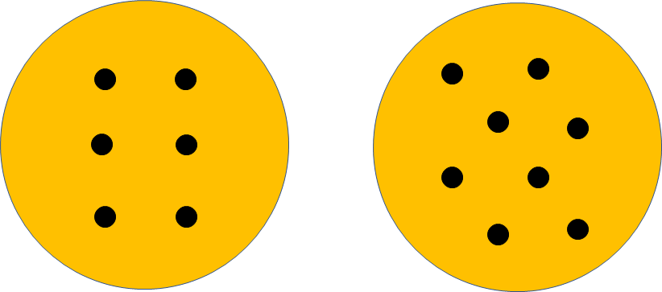
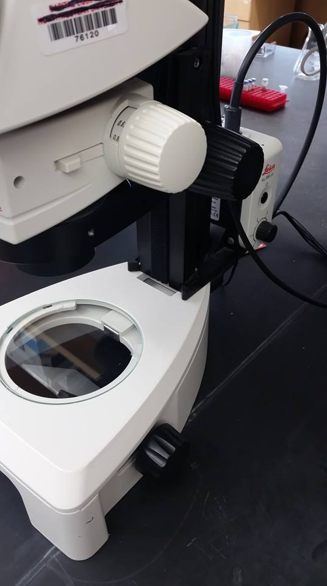
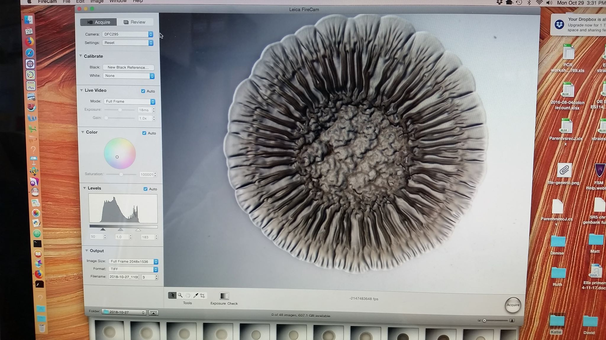

# Wrinkled Colony Assay

The following protocol is used to spot, image, and analyze biofilm formation using a wrinkled colony assay.

## Spotting strains:

1. Grow overnight liquid cultures of each strain needed for the Assay
    - Do not forget to include controls. This includes parent strains, empty vectors, etc.
    - Consider if antibiotic is needed and if controls need that resistance to be spotted on the same plate as the sample.
1. Spot 8ul of each strain in duplicate for each temperature/condition needed.
    - Make sure plate has antibiotic is needed. Note that some antibiotics have an effect on biofilm formation.
    - Up to 6 spots per plate is ideal, but 8 can be done if you stagger spots to optimize distance from plate edge and each other.  
     </IMG>
    - Strains on the same plate are best for comparison. Consider keeping one control on all plates if you cannot get all samples on one plate.
1. Place plates at desired temperatures. Do not flip upside-down as this can misshape undried spots
1. At the 24 hour mark, remove plates from incubator and take a picture on the Leica EZ4 Steromicroscope
1. Place plates back in incubator
1. At the 48 hour mark, remove plates from incubator and take a picture on the Leica EZ4 Steromicroscope

Note: Shorter or longer time points can be used to look at timing of biofilm development or to observe slower biofilm development overtime. For a time course, take pictures between every two hours 16-24 hours or use the Zeiss Axio Zoom V16 Microscope

## Microscope Set-Up:

The Leica microscope should be set as follows to take the biofilm pictures.

#### Scope
- Slider on base that controls reflector plate
  - pushed all the way back
  - plate should be at 45 degree angle facing the back of the scope
  - plate should be on the white (not mirror) side
- Light should be all the way up on 5
- Zoom should be all the way out 0.63

</IMG>

#### Software
The defaults should be correct, but this is the set-up if something got changed:
- Camera is 'DFC295' and setting is 'reset'
- Color is Auto
- Images saved as TIFFs

</IMG>

## Image processing:
Use the following to process biofilm pictures and make a figure:
1. Open the images in Adobe Photoshop
1. Choose the best looking spot of the duplicate ones plated for each strain in each condition
1. Select the *Rectangular Marquee Tool* (dashed rectangle symbol on left side toolbar)
1. Make sure setting on top of window is *Fixed Size* and set to *1300x1300 pixels*
1. Click on image and drag dashed square so that biofilm spot is centered in the rectangle
1. Select *Image > Crop* to crop the picture to this square
1. Once pictures are cropped, save the pictures as new files by going to *File > Scripts > Image Processor *
1. A prompt will appear and use the following settings for each section. These settings will be the default unless someone has needed to change them for processing other images.
  1. Select *Use open images*
  1. Select *Select folder*. Click the words *select folder* to choose the location the pictures save to
  1. For file type, use JPEG set to quality 10
  1. Select *Use ICC Profile*
1. Click *Run* at the top of the prompt box. Box should close.
1. Click *File > Close All* and choose *Don't Save* for all. These are the original images that are open that you don't want to alter. The cropped versions were just saved separately in the image processor step  
1. In finder, go to the file location of the cropped pictures. There should be a "JPEG" folder and this contains the processed images. Rename the folder.

1. Open Adobe Illustrator
1. Go to *File > New* to make a sheet (called artboards) you can add pictures to. You will be prompted to choose artboard size, number, and orientation. One of the of quick selections available is a normal portrait 8.5x11 sheet.
1. Drag and drop in the cropped pictures onto the sheet
1. While all the new pictures are still highlighted, click *Embed* on the top toolbar
1. Use *Object > Transform > Scale* to resize the pictures.
1. Organize pictures into figure. The left hand side of the top tool bar will display the file name of the picture you have selected.
1. To add text, select the text tool (T) and click and drag to make a box. When the text box is selected, the top tool bar will have options for text formatting.
1. Save illustrator file
1. Save pdf file
1. Put PDF file in notebook and figure book.
